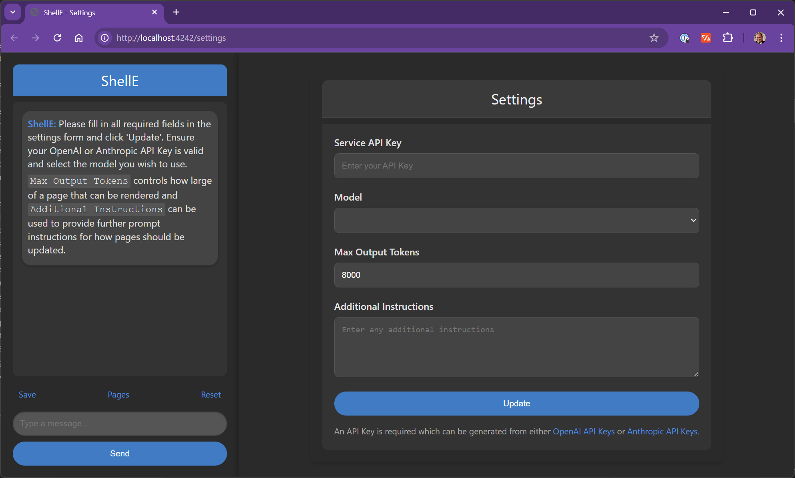
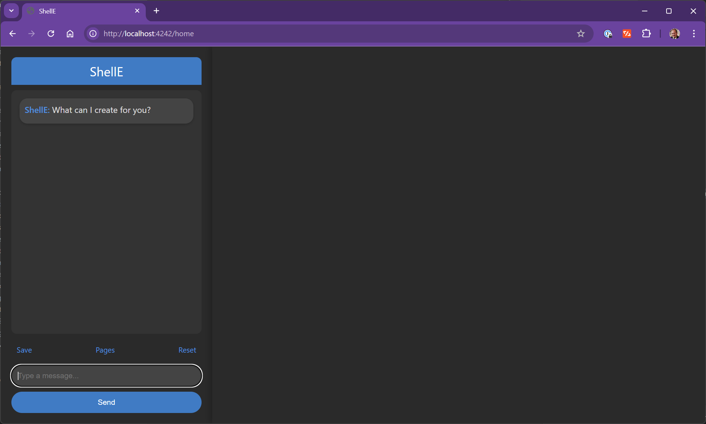

# SynthOS: An AI Powered Interactive Shell Experience

[SynthOS](https://github.com/Stevenic/synthos) is an interactive shell experience powered by generative AI, featuring a user interface that is entirely AI-generated. Similar to a wiki, it organizes everything into pages, but with a twist: these pages are self-modifying and can transform into anything. Each page includes a chat panel and a content viewer. Entering a command into the chat panel prompts the configured Large Language Model (LLM) to completely rewrite the current page. The page can morph into anything—from providing answers to questions to becoming a tool that assists you with complex tasks.

SynthOS has access to tools in the form of APIs and scripts. Built-in APIs enable SynthOS to read and write objects to local storage or make additional generative AI calls. Scripts are user-defined extensions that allow SynthOS to perform local actions on your machine. You can add scripts that let SynthOS start a build, make a Git commit, or run a cURL command.

## Installing SynthOS

To get started using SynthOS you'll need to first install a recent version of [Node.js](https://nodejs.org/en/download/package-manager/current). I use version `18.20.2` but any relatively recent version should work.  You'll also want to go to OpenAI.com [create a developer account](https://platform.openai.com/login?launch) if you don't have one (it's free.)  Once you have your account created you'll need to [generate an API Key](https://platform.openai.com/api-keys) from the Dashboard. Save this key somewhere as you'll need it in a few moments.

Open a terminal window and run the following commands:

```bash
npm install --global synthos
synthos start
```

This will install the CLI and start the SynthOS server running. This terminal window needs to stay open to keep the server running.  You should see a message saying `SynthOS's server is running on http://localhost:4242`.  You can open your browser to that link and you should land on the `settings` page.


## Using SynthOS

The first time you open SynthOS you're going to be directed to a `settings` page where you can enter your API key: 



Enter the OpenAI API key you saved into the API Key field and select the version of GPT-4o you'd like to use from the drop down. `gpt-4o-mini` is the cheapest but it's not as creative as `gpt-4o-2024-08-06`. If you're on a trial account then I'd recommend sticking with `gpt-4o-mini` otherwise I'd go with `gpt-4o` for the best creativity. Another strategy would be to stick with `gpt-4o-mini` while using an app but switch to `gpt-4o` when you want to create something new.  It's also worth noting, that you only incur LLM costs when chatting with the LLM from the chat window so if you're just using an app it created, there's no cost.  And if you're curious the average number of output tokens generated for a simple page is around 2,000 tokens. Add another 500 or so in prompt overhead and most requests will be around 2,500 input tokens and 2,000 generated output tokens.

Once you've entered your API key and selected your model press Update and you should be navigated to the `home` page:



Type in a query like "create a snake game. make it fill the viewer and include a score" to just verify that all of your settings are properly configured and everything is working.


## Page Management

A SynthOS server instance is just a collection of named pages. You can think of it almost like a wiki but every page is generated by an LLM with direction from you. If you look directly above the chat input box you'll see controls for performing basic page management:


- **Save** - Will save the current page to either a new page or over the top of the current page. Any page can be replaced, even the home page.
- **Pages** - Navigates you to the `pages` page where you can see a listing of all the current pages. You can navigate to a different page from either the `pages` page or by setting the `/{page_name}` directly in your browsers address bar.
- **Reset** - Restores the current page back to its last save point. The modifications to a page are cached in the servers memory until their either saved using **Save** or the server is restarted.  Clicking **Reset** lets you manually roll back changes and, trust me, you will be clicking this a lot.

One thing you'll notice is that there's no **Delete** action. This is actually by design. The LLM has direct access to all of these page management features and I didn't want it randomly deciding to write a program that would delete all of its pages.

When you start SynthOS, it creates a `.synthos` subfolder under the folder it was started in. This folder contains your current `settings.json` file and a `.html` file for last save point of every page.  Deleting this .html file will delete the page from the collection but you may need to restart the SynthOS server for the changes to take effect.

Since all of the pages are just static .html files it means that you're to edit them directly using a tool like [VSCode](https://code.visualstudio.com/). You'll need to click **Reset** in the UI to see your manual changes take effect.  Sometimes it's easier to just go in and tweak the final layout of a page manually.


## Tips and Tricks

I'm new to working with SynthOS as well but here's a couple of things I've already figured out.

**Manual Reset**\
Sometimes the LLM will decide to make a change that breaks the entire page. This is when it's useful to know how to manually reset the page to its last save point.  From the address bar append a `/reset` to the current address. So `https://localhost:4242/home/reset` will restore the home page back to its starting state.


**Save Often**\
This goes along with the reset tip. Most things you create are going to take a bit of iteration. You're going to ask the LLM to make a change and it's not going to do exactly what you want or worse break the whole page. Anytime you get something you like save it. Saving is cheap and you can have as many drafts as you want. Just use a naming scheme like `my_app_v2`.

**Walk the LLM to a Design Step-by-Step**\
We're asking the LLM to re-generate an entire page on every request. That's asking a lot. You'll get your best results if you have the model focus on one change at a time (start with layout) and then step your way to a final design, saving anytime you get a result you like.

**Leverage the [templates]**\
Use the provided templates as a starting point for structure or better yet, build your own templates!  I'm still figuring this out but it seems like you want to start with defining the pages layout first because the LLM will naturally want to make any changes within the confines of the current layout. Once you get your layout the way you want add in visual elements like input boxes and such. Then once you get everything visually the way you want you can add in behavior like calling API's or saving to storage.

**Give the LLM Libraries to Use**\
If you have a specific JavaScript library you want to use, find the link on a CDN or the web and then tell the LLM to use that specific version and it will.